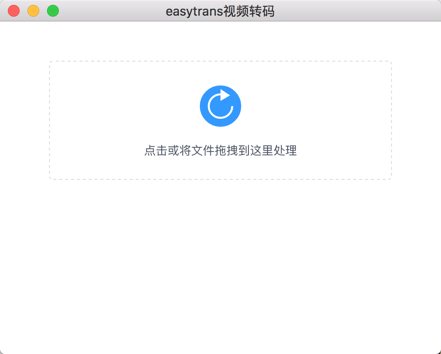
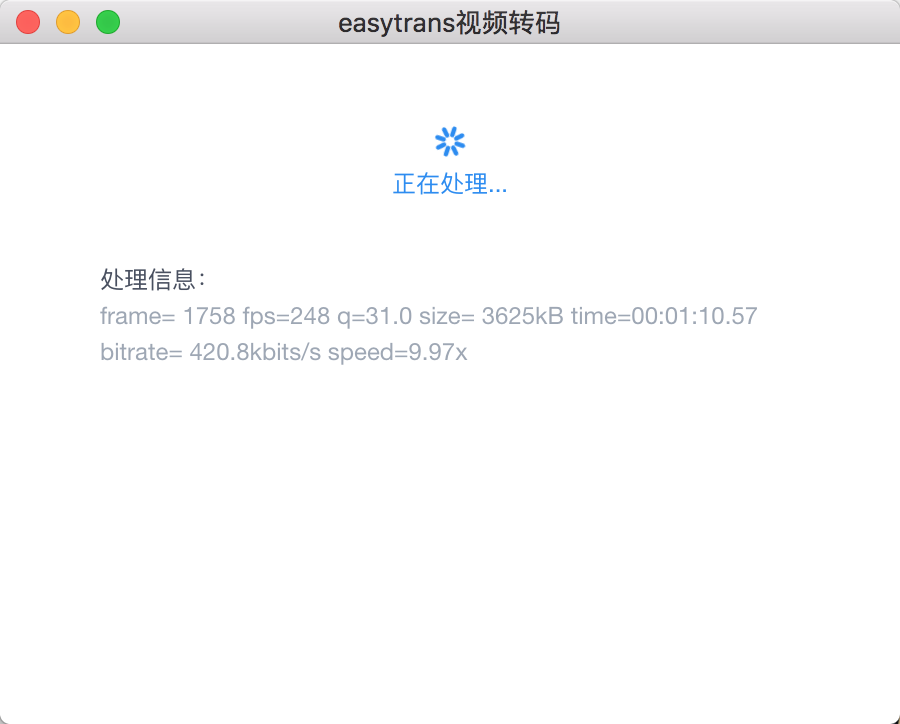
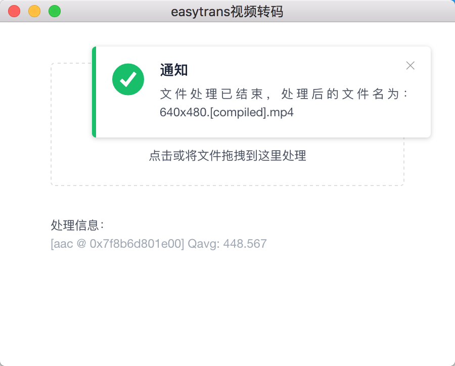

# easytrans
> easytrans 是利用electron、ffmpeg、vue等技术开发的，在Mac上运行的视频转码工具

## 背景
在Mac环境中没有找到很好的、简单的、能够符合自己需求的视频转码工具，特别是针对那些，需在移动端播放的视频的低码率转码，所以就自己动手搞了一个，方便运营人员可以简单粗暴的转码视频。

	
	
	

## 注意：
easytrans依赖于[ffmpeg](https://github.com/FFmpeg/FFmpeg)，请先在Mac上ffmpeg。可以使用[homebrew](https://brew.sh/)来安装：`brew install ffmpeg`

## 运行指令
1. 安装依赖：`npm install`
2. 开发运行：`npm run dev`
3. 打包软件：`npm run build`

## 运行软件
运行打包软件指令后，直接打开打包后生成的文件夹easytrans-darwin-x64里的easytrans.app。

此时，可能有安全提示，请到【设置】-【安全性与隐私】-【通用】下面的【应许从以下位置下载的应用：】中勾选"App Store和被认可的开发者"，并点击【任要打开】。